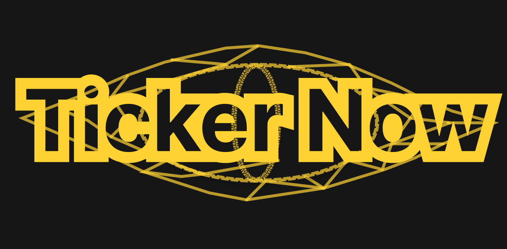

## 🖼 프로젝트 로고

---

## 📈 TickerNow : 기업 뉴스와 주가 데이터를 통해 인사이트를 제공하는 서비스

사용자가 관심 있는 기업의 **주식 정보** 와 **주요 뉴스**를 쉽고 빠르게 확인하고, OpenAI와의 대화를 통해 필요한 정보를 신속하게 얻을 수 있도록 구성된 자동화 크롤링 및 데이터 분석 프로젝트입니다.

---

## 🛠 사용 기술

  <strong>백엔드 관련 기술</strong> 
  
  
  
  
  
  
  

  <strong>프론트엔드 관련 기술</strong> 
  
  
  
  
  
  

---

## 📂 프로젝트 구조

TickerNow/

├── TickerNow-backend/          # 백엔드 서버 소스 코드 및 관련 파일  
│   ├── SqlQuery/               # SQL 쿼리 파일 보관 폴더  
│   ├── csv_folder/             # CSV 데이터 파일 보관 폴더  
│   ├── .gitignore              # Git 무시 파일 설정  
│   ├── OpenAI.py               # OpenAI API 연동 모듈 (대화 및 뉴스 인사이트 제공)  
│   ├── database_search_stock_information_function.py  # DB에서 주식 정보 조회 후 JSON 반환 모듈  
│   ├── daum_search_function.py # Daum 포털 뉴스 크롤링 모듈  
│   ├── login_function.py       # 로그인 기능 모듈 (DB 인증)  
│   ├── main.py                 # 백엔드 메인 실행 파일 (Flask 앱 구동)  
│   ├── server.log              # 서버 로그 파일  
│   ├── sign_up_function.py     # 회원 가입 처리 모듈  
│   ├── stock_load_function.py  # Daum 금융 주식 데이터 크롤러  
│   ├── stock_news.json         # 주식 뉴스 데이터 JSON 파일  
│   └── stock_news_function.py  # 최신 주식 뉴스 크롤링 모듈  

├── TickerNow-frontend/         # 프론트엔드 소스 코드 (React/Vue/기타)  
│   ├── public/                 # 정적 파일 (HTML, 이미지, favicon 등)  
│   ├── src/                    # 프론트엔드 주요 소스 코드 (컴포넌트, 페이지 등)  
│   ├── .gitignore              # Git 무시 파일 설정  
│   ├── eslint.config.js        # 코드 스타일 린팅 설정 파일  
│   ├── index.html              # 웹페이지 기본 HTML 템플릿  
│   ├── package-lock.json       # 패키지 버전 고정 파일  
│   ├── package.json            # npm 패키지 및 스크립트 설정 파일  
│   ├── postcss.config.js       # CSS 전처리기 설정  
│   ├── tailwind.config.js      # Tailwind CSS 설정 파일  
│   ├── tsconfig.app.json       # TypeScript 애플리케이션 설정 파일  
│   ├── tsconfig.json           # TypeScript 컴파일러 설정 파일  
│   ├── tsconfig.node.json      # Node.js용 TypeScript 설정 파일  
│   └── vite.config.ts          # Vite 빌드 툴 설정 파일  

└── README.md                   # 프로젝트 소개 및 설명 문서

---

## 📌 주요 기능

- 수집된 정보를 기반으로 기업 소식을 전달하고, 주가 정보를 그래프로 시각화하여 제공  
- 웹 기반 회원가입 및 로그인 시스템  
- Daum 금융에서 주식 정보 실시간 크롤링  
- 기업명을 기반으로 최신 뉴스 기사 자동 수집  
- OpenAI API를 활용한 수집된 뉴스를 바탕으로 사용자와의 대화 기능 제공  
- Apache Spark를 활용한 수집 데이터 가공 및 저장  
- MySQL 연동을 통한 주식 정보, 뉴스, 회원 정보 통합 저장 및 관리  
- 회원가입 시 SHA-256으로 비밀번호를 암호화해 저장하고, 로그인 인증 성공 시 JWT를 발급하여 클라이언트의 세션 및 인증  

---

## 👥 프로젝트 참여자 상세 역할

| 이름   | 주요 담당                    | 상세 내용                                                                                                                                         | GitHub |
|--------|-----------------------------|---------------------------------------------------------------------------------------------------------------------------------------------------|--------|
| 박재혁 | 백엔드 개발 | - Daum 금융/포털 데이터 크롤링 모듈 개발 - Apache Spark 및 MySQL로 데이터 가공 및 저장 - OpenAI API를 활용하여 사용자 대화 기록을 기반으로 한 맞춤형 대화 기능 등 | [github.com/dndjeh](https://github.com/dndjeh) |
| 박종혁 | 프론트엔드 개발 | - 차트 기능 개발  - 크롤링 페이지 폼 작성  - 채팅형 UI  - 회원가입/로그인 모듈 개발 등 | [github.com/dign1120](https://github.com/dign1120) |

---

## 🎥 시연 영상

[👉 시연 영상 바로 보기](https://drive.google.com/file/d/1jx62D_lsXW-Gv_5ZYdd0RqRqnCbDqmhW/view?usp=sharing)
